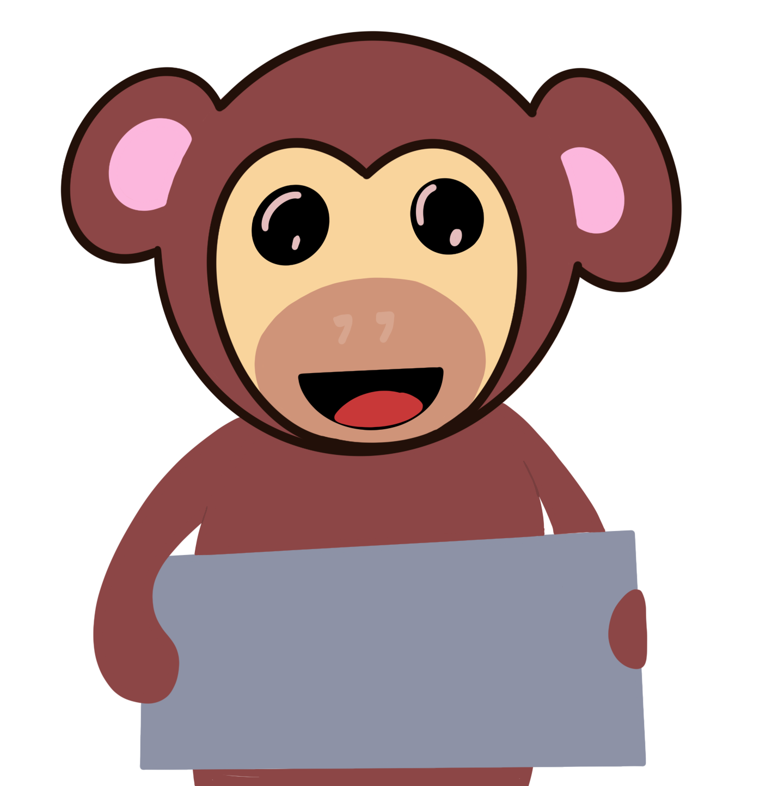
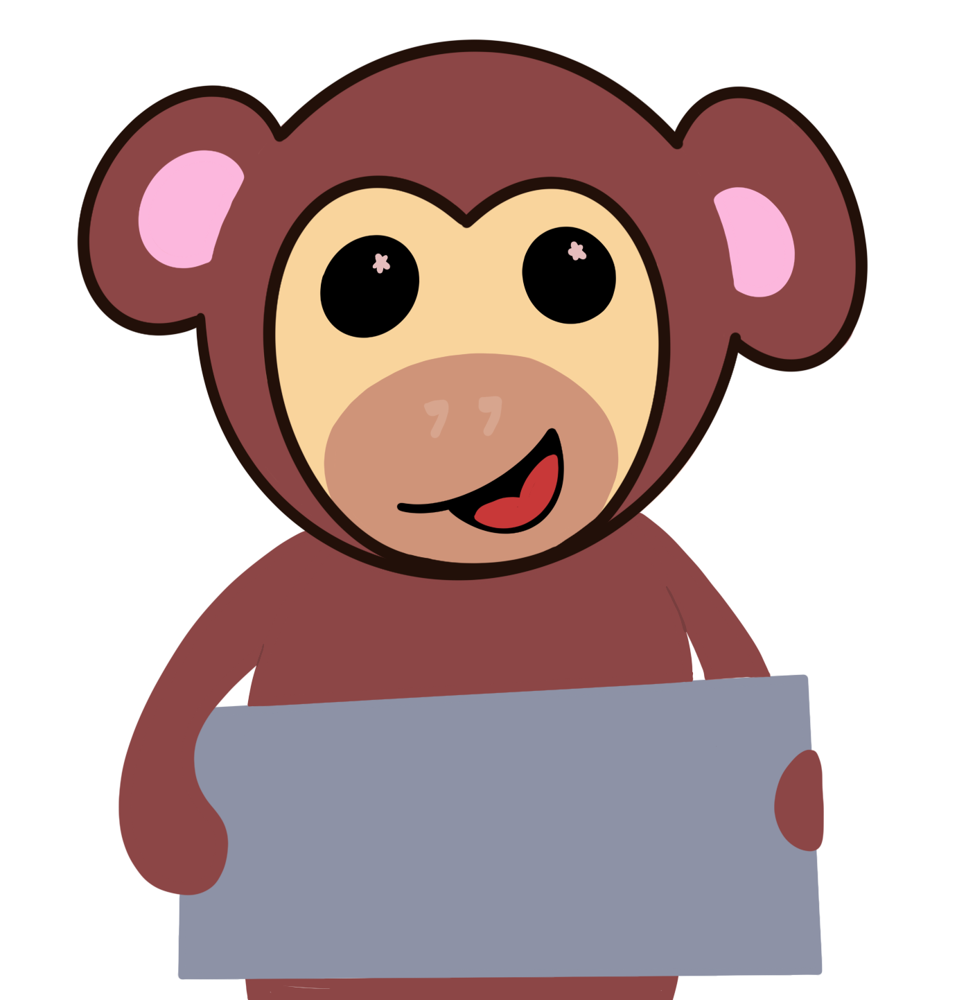
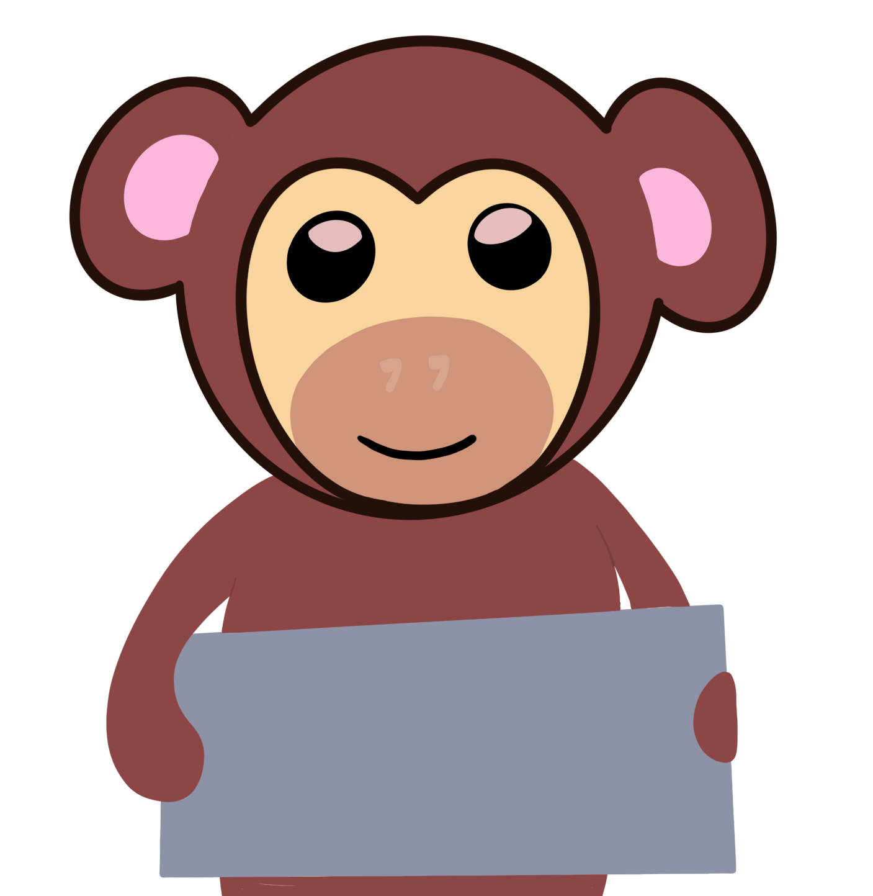
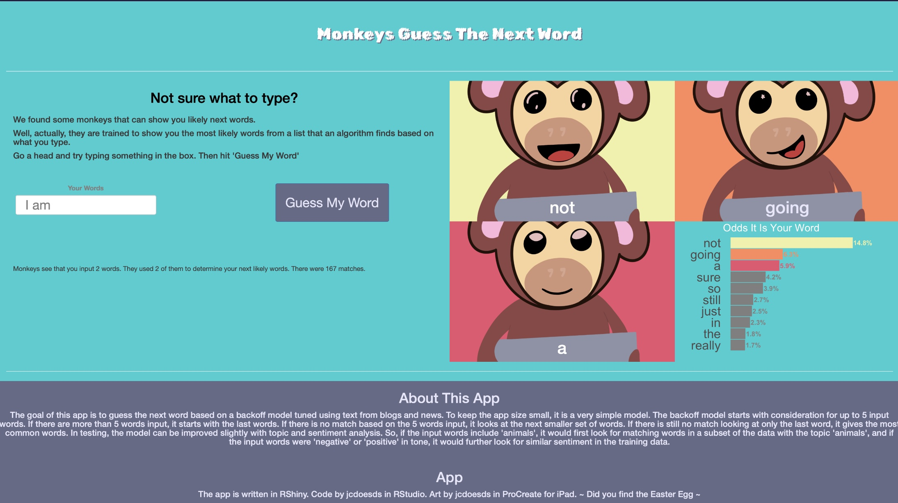

```{r setup, include=FALSE}
knitr::opts_chunk$set(echo = FALSE)
```

The Problem You Face
====================================

Who types anything anymore. To be able to compete, you need to cheat.

You **need** my monkeys to guess your next word. 


{width="30%"}{width="30%"}{width="30%"}


How it Works
==================================
 
 Our working prototype is based on blogs and news data, covering over 70% of the total combinations of words in our sample, including, for example:
 
  - **over 26,500** combinations of two word grams based on *3,526* unique starting words - allowing us to guess the next word
  - **over 42,900** combinations of three word grams based on *15,911* unique starting words - allowing us to guess the next word
  - **over 550** combinations of six word grams - getting very specific for some 
 phrases
 - using a backoff chain, it starts with up to the last five words a user entered
 - and that is our simple space saving prototype


Working Prototype
==================================== 
In our working prototype, you can see that the user typed "I am", and the monkeys
guessed 'not', 'going', and 'a' as likely next words. There is also a graph showing the odds that is the next word, given the user's input based on the data in the model. [Try it yourself on Shiny](https://jcdoesds.shinyapps.io/monkeysnextwordapp/)

{width="70%"}


Fund Us Now
====================================

Our working prototype only shows you the best guesses that our monkeys can find.
With additional funding and storage space on your local servers, we will:

 - build the model based on your own text. Consider using documents, email, tables with your specific industry phrasing.
 - have extensive topic models. There may be different likely words for the cotton candy stand than the Ferris wheel, for example.
 - expand the model to consider the user's sentiment. Reporting on broken or failing equipment sounds different than on new projects. 